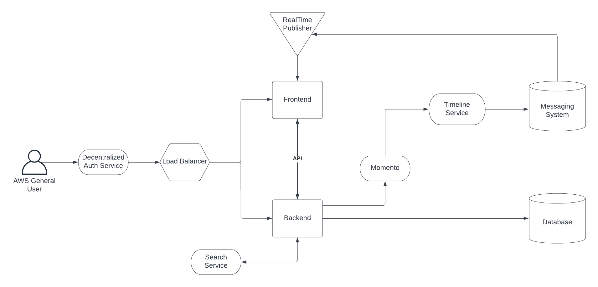

# Week 0 — Billing and Architecture

## Required Homework / Tasks

### Recreate Conceptual Diagram in Lucid Charts or on a Napkin

I was able to recreate the Conceptual diagram in Lucid Charts.

Here is the **[link](https://lucid.app/lucidchart/b9114b8d-722f-46d8-95a8-bab65283e72e/edit?viewport_loc=-497%2C-1089%2C2219%2C1097%2C0_0&invitationId=inv_31a98571-6837-4f21-9a8f-7877fa2b440c)** for reference

### Recreate Logical Architectual Diagram in Lucid Charts

I was able to recreate the logical architecture diagram in Lucid Charts.

Here is the **[link](https://lucid.app/lucidchart/b9114b8d-722f-46d8-95a8-bab65283e72e/edit?viewport_loc=-366%2C-136%2C3328%2C1646%2CfHEx2YcneaGm&invitationId=inv_31a98571-6837-4f21-9a8f-7877fa2b440c)** for reference

### Installed AWS CLI

**Notes to complete**

### Create a Billing Alarm

**Notes to complete**

### Create a Budget

**Notes to complete**

## Homework Challenges
